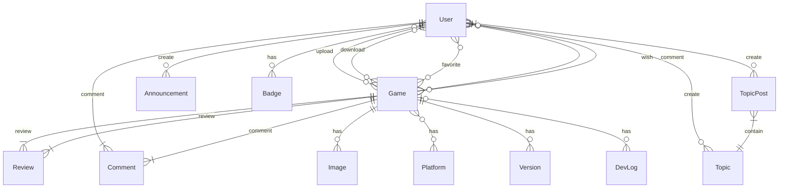

# FanGame Archive FGA

## Introduction

Cette project est un logiciel qui vise a rendre les fangame a but non-lucratif plus acessible et archivable pour le developpeurs afin que leur travail ne se perde pas au fil du temps. Il s'agit de valoriser leurs créations, de les rendre visibles aux générations futures et d'inspirer les jeunes passionne et intéressé

| Persona | Description |
|---------|-------------|
| **Name** | Mike |
| **Age** | 22 |
| **Profession** | Webdev : Backend |
| **Objectifs** | Fangame submiter |
| **Frustrations** | not being able change the url not being able upload the source code |
| **Behaviors** | frequently update the archive page for it to be up to date |

| Persona 2 | Description |
|---------|-------------|
| **Name** |                                                |
| **Age** | 27 |
| **Profession** | CyberSecurity |
| **Role** | Admin/Moderator |
| **Frustrations** | not being able verify on release |
| **Behaviors** | checks the current fangames and for any malicius behavior |

| Persona 3 | Description |
|---------|-------------|
| **Name** | David |
| **Age** | 20 |
| **Role** | Site User |
| **Frustrations** | not being able to search for specific stuff not being able to filter by category |
| **Behaviors** | Downloads games and plays them |


# Epic 1: 

## US 1 : En tant que visiteur, je veux télécharger des fangames afin d'y jouer
- CA 1 : No account needed to download small games
- CA 2 : If the game is too big visitor is forced to make an account
- CA 3 : Accept the terms of service to download fangames

## US 7 : En tant que visiteur, je veux rechercher les fangames afin de trouver ceux qui correspondent à mes intérêts
CA 1 : Filter by category
CA 2 : Filter by platform
CA 3 : Filter by development status
CA 4 : Sort by newest, most downloaded or highest liked


## US 8 : En tant que visiteur, je veux consulter les informations d'un fangame afin de savoir s'il m'intéresse avant de le télécharger
CA 1 : View screenshots
CA 2 : View description
CA 3 : View version history
CA 4 : View changelog
CA 5 : View supported platforms and file size

## US 2 En tant que visiteur avec un compte, je veux recevoir des recompenses afin de participer et contribuer au site
- CA 1 : Favorite games
- CA 2 : Have badges for playing games and meeting certain criteria
- CA 3 : Have access to message boards
- CA 4 : Site Newsletter
- CA 4 : Intrest list for game that have yet to release

## US 3 : En tant que developpeur, je veux téléverser mon fangame et code source afin de le partager a toute la communautée
- CA 1 : Put multiple versions of the game and source code 
- CA 2 : Can private the access to the assets
- CA 3 : Allow a certain user to get a beta build of the game for their efforts
- CA 4 : give a specific avatar 
- CA 5 : preserve metadata (engine, build, platform, dependenices)

## US 4 : En tant que developpeur, je veux modifier la page et lien de jeu afin du la mettre la page sur le bon theme
- CA 1 : Can edit the background and the layout of the page manually
- CA 2 : Can edit the link and where they bring the user
- CA 3 : Can the access to the source code directory

## US 5 : En tant que modérateur, je veux teste le fangame pour la moderation
- CA 1 : Can access to a early build of the game for regulation
- CA 2 : Can access to the a preview of the archive page
- CA 3 : Can inspect the code repsitory for regulation

## US 6 : En tant que visiteur avec un compte, je veux laisser des commentaires et des avis
- CA 1 : Can publish a review under a gamepage
- CA 2 : Can edit or delete a past review

## US 10 : En tant qu'utilisateur, je veux signaler un contenu afin d'aider à maintenir une communauté saine
CA 1 : Report a game
CA 2 : Report a comment
CA 3 : Notify moderators

*Entity Relation Diagram*


<!-- 
*Diagramme MCD*
```mermaid
erDiagram
    User {
        int Id PK
        string Name
        string email
        string password
    }

    Submiter {
        int Id PK
        string Name
        string email
        string password
    }

    Admin {
        int Id
        string Name
        string email
        string password
    }

    Game {
        int Id PK
        string Name
    
    }
    
    Page {
        int id PK
        int SubmiterId FK
    }
    
    Announcement {
        int id PK
        ink  SubmiterId FK
    }

    Comment {
        int id
        int UserId FK
        int GameId FK
        string message
    }

    User ||--o{ Comment : has
    Comment }o--o{ Game : has
    Admin ||--o{ Comment : delete
    User ||--o{ Game : has

    Submiter ||--o{ Game : upload
    Admin ||--o{ Game : aprove
    Submiter ||--o{ Page  : create
    Admin ||--o{ Page : aprove
    Submiter ||--o{ Announcement : create
``` -->